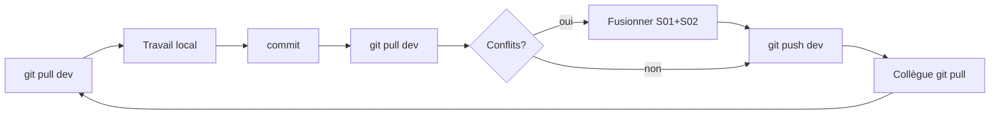

# Workflow Git — équipe Zombie Survival

Objectif : **Bruno et Georges travaillent en parallèle**, fusionnent sur `dev`, et ont **la même version** pour continuer le cycle suivant.

---

## 1. Modèle de branches

```
master          → production (Infomaniak) — merge depuis dev, validation manuelle
dev             → intégration quotidienne — TOUS les pushes de feature vont ici
feature/xxx     → optionnel, pour un gros chantier isolé plusieurs jours
```

Ne pas développer sur `master`.

---

## 2. Rituel début de journée

```bash
cd zombie-survival
git checkout dev
git fetch origin
git pull origin dev
```

Si `git pull` affiche des conflits → section 5 ci-dessous.

**Node 20** pour le serveur local (`nvm use 20` ou raccourci bureau `ZS - Demarrer serveur`).

---

## 3. Rituel fin de journée (ou avant pause longue)

```bash
git status
# Vérifier : pas de .env, sqlite, tmp-footsteps, tmp-*.ogg dans le staging

git add <fichiers du chantier>
git commit -m "feat: description courte" -m "Pourquoi : une ou deux phrases."

git pull origin dev    # IMPORTANT : récupérer le travail du collègue
git push origin dev
```

Message au collègue (Discord / etc.) :

> « J'ai poussé sur `dev` : [résumé]. Fais un `git pull` avant de reprendre. »

---

## 4. Zones qui se chevauchent souvent

Ces fichiers sont modifiés par **S01 (Bruno)** et **S02 / prefabs (Georges)** :

| Fichier | Contenu typique |
|---------|-----------------|
| `packages/shared/src/sector-bounds.mjs` | Limites jouables serveur (S01 + S02 + couloir) |
| `apps/client/public/js/sector_bounds.js` | Idem côté client |
| `apps/client/public/js/spawn_clearing.js` | Prefabs cabane + small city + coffre |
| `packages/shared/src/s01-world-placements.mjs` | Seeds S01 |
| `apps/client/public/js/decor_colliders.js` | Collisions shack + maisons |

**Règle** : avant d'éditer, `git log -3 -- <fichier>` — ne pas écraser une feature validée par l'autre.

---

## 5. Résolution de conflits

1. Ouvrir le fichier marqué `<<<<<<<` / `=======` / `>>>>>>>`
2. **Garder les deux intentions** quand c'est possible (ex. `PLAYABLE_AREAS` S02 + seed `cabin01:chest`)
3. Supprimer les marqueurs de conflit
4. `git add <fichier>` puis `git commit` (merge commit automatique si besoin)
5. Tests minimaux :
   ```bash
   node --test tests/sector-bounds.test.mjs
   node --test tests/s01-cabin01-chest.test.mjs
   node --test tests/sectors.test.mjs
   ```

En cas de doute : demander au collègue **avant** de choisir « tout supprimer d'un côté ».

---

## 6. Fichiers à ne jamais committer

- `.env`, `.env.*`
- `database/*.sqlite`, `database/*.sqlite-*`
- `notes-local/`
- `tmp-footsteps/`, `tmp-*.zip`, `tmp-*.ogg`, `tmp-*.flac`
- `.world_clean_slate_*`

---

## 7. Checklist avant push

- [ ] `DEV_TRACKER.md` mis à jour (date + résumé)
- [ ] `client-version.json` incrémenté si JS client modifié
- [ ] `git pull origin dev` fait **après** le dernier commit local
- [ ] Pas de secrets / tmp dans le commit
- [ ] Tests liés au chantier passent (ou échecs connus notés dans le tracker)

---

## 8. Cycle continu



---

## 9. Raccourcis Windows (Bruno)

Bureau : `ZS - Demarrer / Arreter / Redemarrer serveur` → `tools/desktop/`

Après changement `packages/shared` : **redémarrer le serveur** (pas seulement `decorseed`).

---

Index docs : [README.md](README.md)
