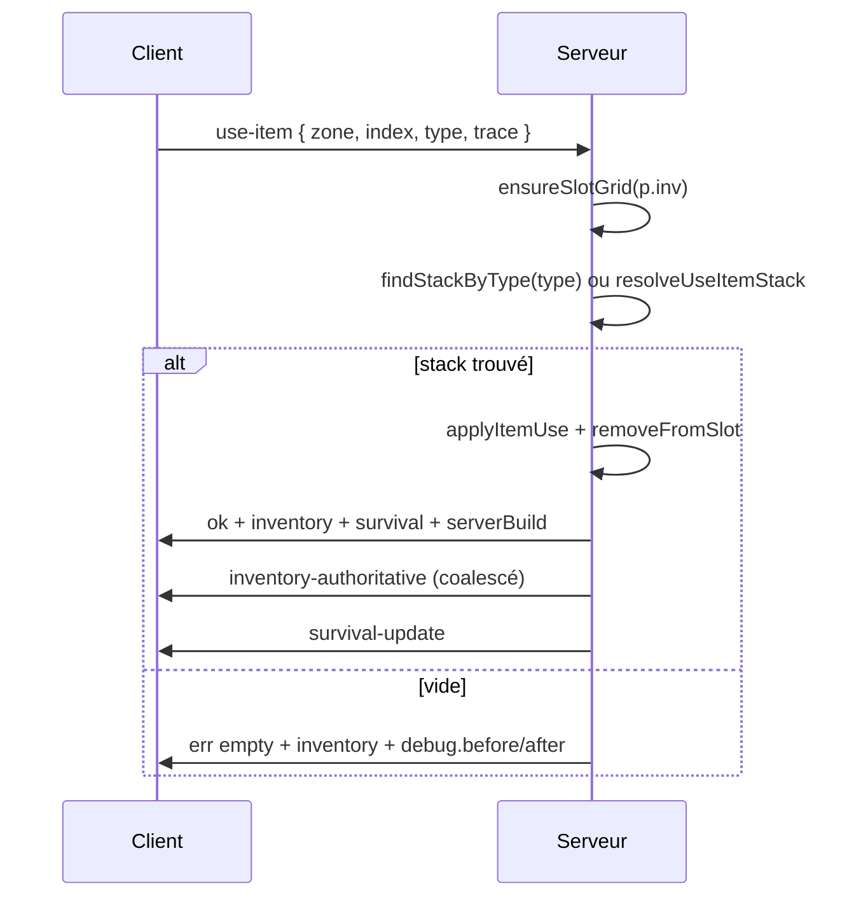

# Inventaire & consommation (eau, nourriture, soins)

Guide de référence pour le flux authoritatif inventaire / `use-item`, les bugs corrigés en juin 2026, et le débogage corrélé client ↔ serveur.

Voir aussi : [ARCHITECTURE.md — Server authority](./ARCHITECTURE.md#server-authority-anti-cheat).

---

## Résumé

- **Source de vérité** : le serveur (`apps/server/index.js` + `inventory-ops.js`).
- **Client** : affiche l’inventaire reçu via `game-init` et `inventory-authoritative` ; n’envoie plus de `inventory-sync`.
- **Consommation** : le client émet `use-item` avec `{ zone, index, type, trace }` ; le serveur résout le stack **par type en priorité**, applique l’effet, retire 1 qty, renvoie `{ ok, inventory, survival, serverBuild }`.

Version courante (juin 2026) : `20260608-fix-health-sync-270` (client + serveur alignés).

---

## Flux `use-item`



### Règles serveur

| Étape | Module | Comportement |
|-------|--------|--------------|
| Grille hotbar/sac | `ensureSlotGrid` | 6 slots hotbar ; sac selon sac équipé ; **ne supprime jamais** les stacks (overflow sac → hotbar, reste conservé dans `bag` si hotbar pleine) |
| Résolution | `findStackByType` | Cherche `food_*` / item par type dans hotbar puis bag |
| Fallback slot | `resolveUseItemStack` | Si type introuvable, tente le slot exact `{ zone, index }` |
| Secours | `ensureStarterRations` | Si aucune nourriture, réinjecte eau + sandwich (sauf réveil sleeper / respawn) |
| Réponse | `use-item` ack | Toujours inclure `serverBuild` ; en échec inclure `inventory` cloné pour resync client |

### Règles client

| Fichier | Rôle |
|---------|------|
| `survival.js` | `useItem(type, slot)` → `Network.requestUseItem` ; applique `inventory` + `survival` de la réponse |
| `inventory.js` | `loadFromSave` ; `_migrateBagToHotbarIfNoSac` (sans sac équipé, aligné `ensureSlotGrid`) ; `findItemSlot(type)` |
| `network.js` | `game-init` charge inventaire ; compare / snapshot debug ; alerte si `serverBuild` absent |
| `consume_debug.js` | Logs `[inv-debug]`, `ZS.ConsumeDebug.dumpWithServer()` |

### Ordre d’init (client)

`Inventory.init` + `Survival.init` **avant** `Network.init` — `game-init` appelle `loadFromSave` / `spawnWorldItem` qui nécessitent l’inventaire prêt (`game.js`).

---

## Handlers Socket enregistrés tôt

`use-item` et `debug-inv-snapshot` sont enregistrés dans `_registerInvConsumeHandlers()` **immédiatement après** `players.set()`, pas après des centaines de lignes d’autres handlers. Cela évite une course où le client envoie un snapshot ou une consommation avant que le handler existe.

---

## Vérification version client / serveur

Après toute modification **serveur** (`apps/server/index.js`, `inventory-ops.js`, etc.) :

1. **Arrêter** le process Node sur le port 3000 (Task Manager ou `taskkill`).
2. Relancer : `npm run dev:server` (ou `npm start`).
3. **Ctrl+F5** dans le navigateur (client Vite `:5173` ou `:3000`).

### Signaux dans la console client (filtre `inv-debug`)

| Log | Attendu |
|-----|---------|
| `server-health` | `invDebugBuild: "20260608-fix-inv-restart-269"` (identique au client) |
| `game-init-server-build` | `serverBuild` présent et égal à `clientVersion` |
| `debug-snapshot-res` | Réponse après `debug-snapshot-req` |
| `use-item-ack` | `serverBuild` présent ; `ok: true` si consommation réussie |

### Signaux d’alerte (serveur pas redémarré)

- `invDebugBuild: undefined` sur `/api/health` alors que le client est à jour.
- `debug-snapshot-req` **sans** `debug-snapshot-res`.
- `use-item-fail` + `err: empty` + `serverFood: Array(0)` alors que le client affiche encore de la nourriture.
- Notification UI : *« Serveur ancien — arrêter Node puis npm run dev:server »*.

`GET /api/health` expose `invDebugBuild`. `game-init` expose `serverBuild` / `invDebugBuild` pour vérifier la même build que le socket actif.

---

## Bugs corrigés (session 2026-06-08)

### 1. `ensureSlotGrid` détruisait la nourriture

**Symptôme** : `use-item` → `err: empty` ; inventaire serveur à 0 nourriture après tentative.

**Cause** : sans sac équipé (`bagCapacity = 0`), l’ancienne logique vidait `bag` même si la hotbar ne pouvait pas tout absorber.

**Fix** : `apps/server/src/inventory-ops.js` — overflow sac → hotbar ; stacks non placés **conservés** dans `bag`.

### 2. Désync slot bag / hotbar

**Symptôme** : `compare-slot-offset` au `game-init` ; client envoie `hotbar` index 2, serveur a l’item en `bag`.

**Cause** : le client migre visuellement sac → hotbar ; l’ancien `use-item` ne cherchait que le slot exact.

**Fix** : `findStackByType` prioritaire ; migration client `_migrateBagToHotbarIfNoSac` ; starters en hotbar slots 2–3 dans `STARTING_ITEMS`.

### 3. Nourriture fantôme côté client

**Cause** : `ensureStarterRations` côté client sans sync serveur.

**Fix** : retiré des chemins d’init ; starters uniquement serveur (`ensureStarterRations` à la connexion, sauf `wokeFromSleep`).

### 4. Ordre d’init client

**Cause** : `Network.init` avant `Inventory.init` → crash ou état incohérent au `game-init`.

**Fix** : ordre corrigé dans `game.js`.

### 5. Serveur Node non rechargé

**Symptôme** : client v268/v269, `invDebugBuild: undefined`, handlers absents.

**Cause** : process Node lancé avant les edits ; `clientVersion` lu depuis le fichier JSON mais code `index.js` ancien en mémoire.

**Fix** : redémarrage obligatoire ; champs `invDebugBuild` / `serverBuild` ; alertes UI + logs.

### 6. PV à zéro après consommation (sandwich / eau)

**Symptôme** : la barre de vie tombe à 0 juste après `use-item`, sans lien avec l’aliment.

**Causes** :
1. **`_syncArmor` client** : après `applyAuthoritativeInv`, un `p.health` invalide (`null`) était traité comme `0` par `Math.min(max, null)`.
2. **PV serveur non synchronisés** : le client affichait `localStorage` / 100 par défaut ; le `survival-update` forcé après consommation révélait les vrais PV serveur (blessure, infection, faim).

**Fix (v270)** : `_syncArmor` ne modifie plus `p.health` ; `health` dans `game-init` et ack `use-item` ; application explicite côté client.

### 7. Réveil depuis sleeper (`wokeFromSleep: true`)

Inventaire restauré depuis `priorSleep.inv` (pas la DB, pas de kit starters). La migration `ensureSlotGrid` + `_cloneInv` à la connexion aligne sac/hotbar avant `game-init`.

---

## Débogage

### Console navigateur

```text
Filtre : inv-debug
```

```javascript
ZS.ConsumeDebug.dump()              // historique localStorage + snapshot client
ZS.ConsumeDebug.dumpWithServer()    // + requête debug-inv-snapshot
```

### Terminal serveur

```text
Filtre : inv-debug
```

Corréler via `trace` (ex. `usemq4udwx5-4`) entre `use-item-req`, `use-item-ok` / `use-item-empty` et logs client.

### Tests automatisés

```bash
node --test tests/inventory-ops.test.mjs tests/use-item-resolve.test.mjs
```

Cas couverts : overflow sac → hotbar, conservation si hotbar pleine, consommation eau après migration, résolution par type.

---

## Fichiers clés

| Fichier | Rôle |
|---------|------|
| `apps/server/index.js` | `use-item`, connect, starters, `_registerInvConsumeHandlers`, `_gameInitPayload` |
| `apps/server/src/inventory-ops.js` | `ensureSlotGrid`, `findStackByType`, `resolveUseItemStack`, `cloneInv` |
| `apps/server/src/inv-debug.js` | Snapshots + logs serveur `[inv-debug]` |
| `apps/client/public/js/consume_debug.js` | Debug corrélé client |
| `apps/client/public/js/survival.js` | `useItem`, application réponse serveur |
| `apps/client/public/js/inventory.js` | `loadFromSave`, migration sac, `findItemSlot` |
| `apps/client/public/js/network.js` | `game-init`, `requestUseItem`, snapshots |
| `packages/shared/src/item-effects.mjs` | Effets `food_eau_bouteille`, `food_sandwich`, etc. |

---

## Checklist après changement inventaire

- [ ] `npm run dev:server` redémarré (vérifier log `[inv-debug] server build`)
- [ ] `apps/client/public/client-version.json` incrémenté
- [ ] Ctrl+F5 client
- [ ] Console : `invDebugBuild` = `clientVersion`
- [ ] Test manuel : consommer eau + sandwich (spawn frais et réveil sleeper)
- [ ] `DEV_TRACKER.md` mis à jour
- [ ] Ce doc / `ARCHITECTURE.md` si le comportement change
